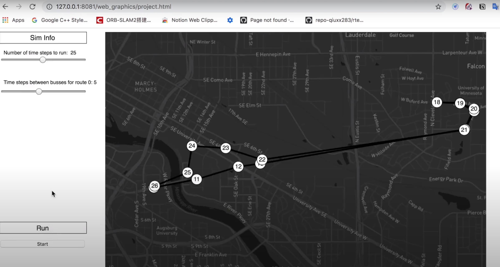
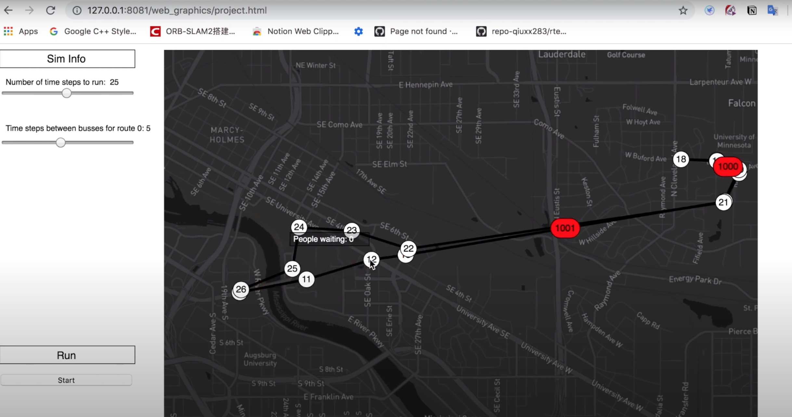

# Transit_simulator
Software Development

  

  Before moving around the bus, there are bus stops and passenger on bus stop

  

  Before the bus moves, the bus will take the passenger on/off at the bus stop. If the bus is already full, bus can not take more passenger. If not, take passenger. Furthermore, if the bus reaches the bus stop, the bus drops the passengers who has current stop as final destination.  

